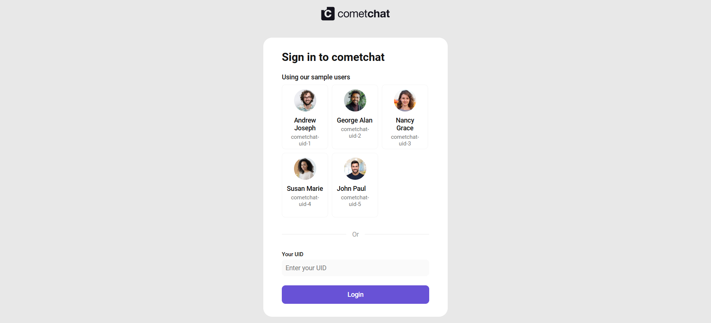
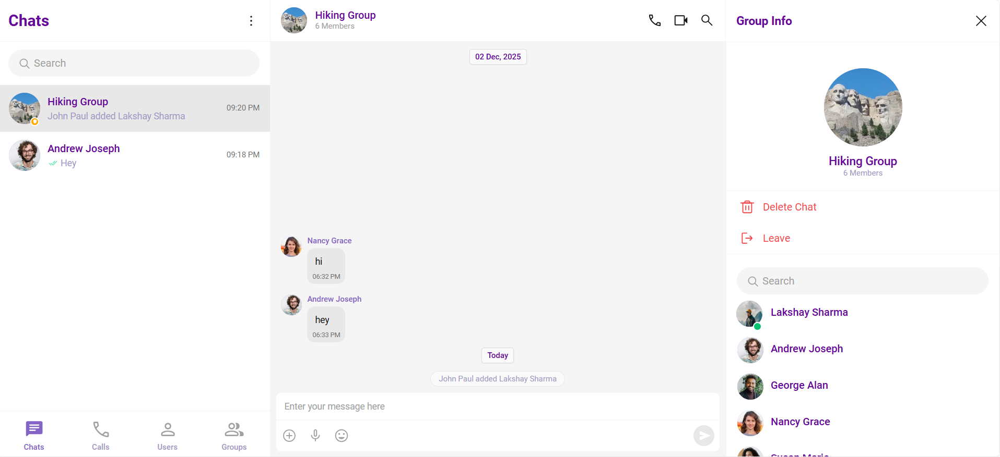
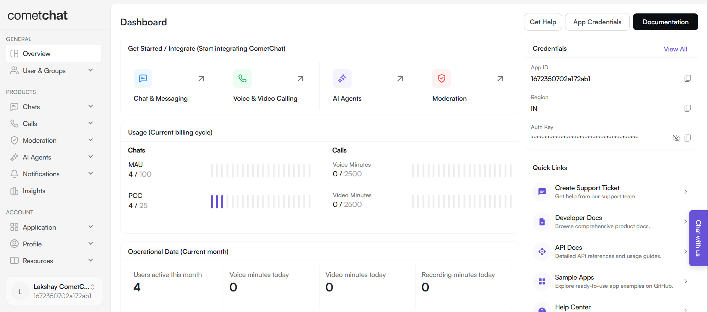

# CometChat Internship Task – UI Kit Implementation & Evaluation

[](https://react.dev/)
[](https://www.cometchat.com/)
[]()
[-yellow)]()

---

## Overview

This repository contains the implementation of the **CometChat UI Kit (React)** along with a full analysis report covering:

- Platform onboarding experience
- Dashboard usability
- Documentation clarity
- UI Kit Builder workflow
- Integration testing with sample users

This submission is part of the **CometChat Internship Technical Task.**

---

## Tech Stack

| Technology | Purpose |
|-----------|---------|
| **React** | Front-end application framework |
| **CometChat UI Kit Builder** | Pre-built messaging UI exported as a React app |
| **JavaScript (ES6+)** | Core language used in integration |
| **Node.js + npm** | Dependency and runtime support |

---

## Project Structure

cometchat-internship-task/  
├─ 📁 cometchat-react-ui-kit/  
│ ├─ public/  
│ ├─ src/  
│ └─ package.json  
├─ 📄 CometChat_Internship_Report_Lakshay_Sharma.pdf  
└─ 📄 README.md  


---

## Installation & Setup

Follow the steps below to run the project locally:

```sh
# 1. Clone this repository
git clone https://github.com/Lakshay-hub-design/cometchat-internship-task.git

# 2. Navigate into project folder
cd cometchat-app-react

# 3. Install dependencies
npm install

# 4. Create your .env file based on .env.example
# Add your own CometChat App ID, Region, and Auth Key

# 5. Start the project
npm start

```
## Screenshots

### 🔹 Login Screen


### 🔹 Chat UI


### 🔹 Dashboard


---

## Report

The complete findings and evaluation report is included as a PDF:

📎 CometChat_Internship-Findings.pdf

This report covers:

- Expected vs actual experience
- Friction points & usability observations
- UI Kit implementation evaluation
- Bugs, unclear steps, and improvement suggestions

---

## Author

Lakshay Sharma  
📧 lakshay0328@gmail.com  
🌍 India

---

## Final Note
Thank you CometChat team for the opportunity.
This assignment helped me understand the platform deeply, from user onboarding to UI customization and real-time messaging integration.
